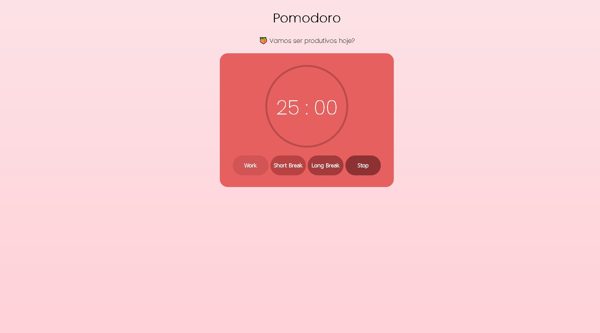

    <h1>🍅 Pomodoro</h1>
    
Detro desse projeto criei um temporizador para ser utilizado na técnica de concentração pomodoro.
    O objetivo desse projeto foi treinar Programação Orientada a Objetos, em JavaScript, e ser algo simples e bonito.

    <h2>💻Linguagens usadas<h2>
    
    
    

    

